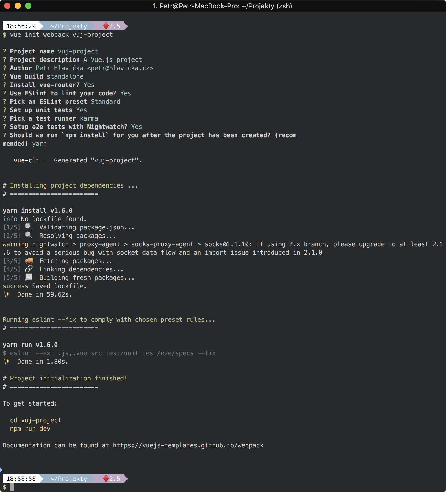
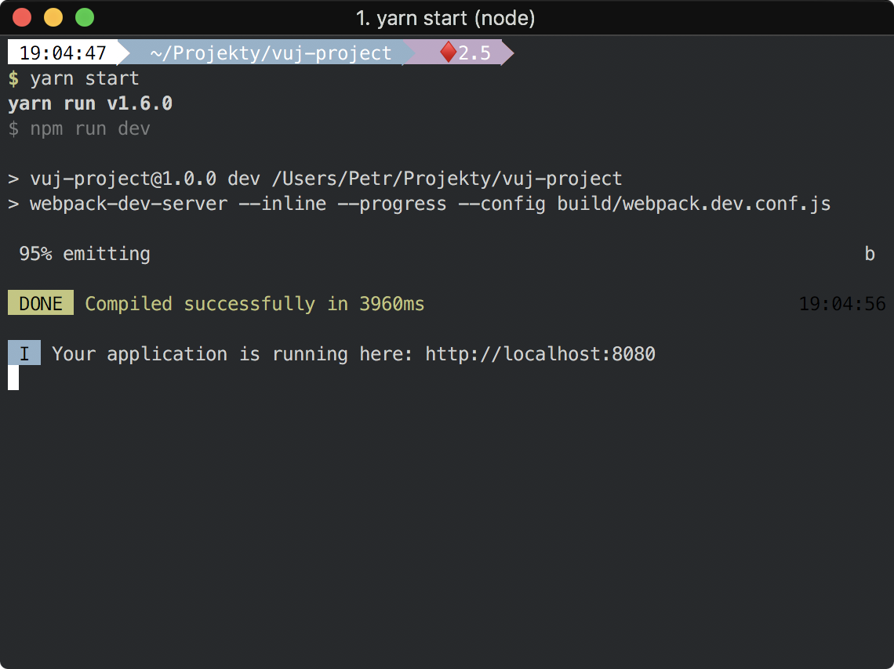
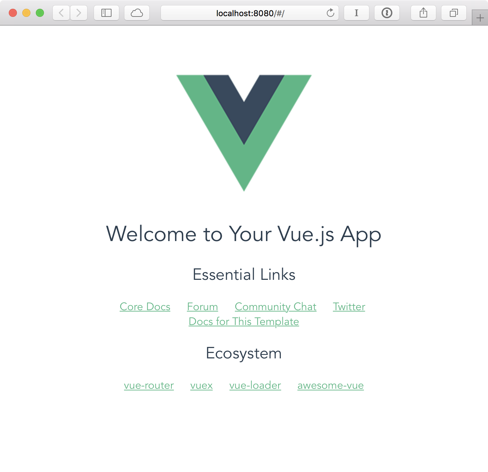
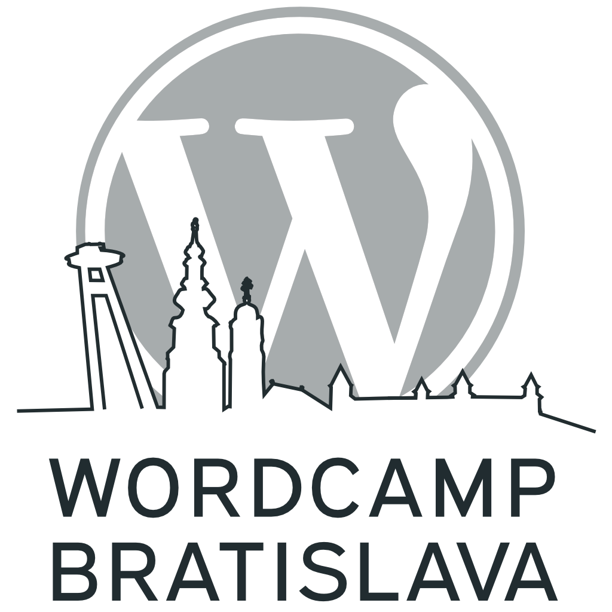

theme: Plain Jane, 1
slidecount: true
slidenumbers: true
build-lists: true
autoscale: true


# Vue.js a WordPress

## Petr Hlavička

### [hlavicka.cz](https://www.hlavicka.cz/)

[.slidecount: false]
[.slidenumbers: false]

---

## Obsah přednášky

- Úvod
- Základy Vue.js
- Možnosti použití s WordPress

[.footer: Petr Hlavička: Vue.js a WordPress]

---

## O přednášce

- bude techničtější
- stačí základy JavaScriptu
- modrý text jsou odkazy
- dotazy až na konec

[.footer: Petr Hlavička: Vue.js a WordPress - Úvod]

---

## Proč Vue?

- progresivní
- reaktivní (reactive)
- [virtuální DOM](https://medium.com/js-dojo/whats-the-deal-with-vue-s-virtual-dom-3ed4fc0dbb20)
- flexibilní
- velikost (84.4KB => okolo 30.90KB s gzip)
- dokumentace

[.footer: Petr Hlavička: Vue.js a WordPress - Úvod]

---

## Co konkurence?

[Comparison with Other Frameworks](https://vuejs.org/v2/guide/comparison.html) - srovnání s React, AngularJS, Angular, Ember, Knockout, Polymer a Riot.

[.footer: Petr Hlavička: Vue.js a WordPress - Úvod]

---

## Základy Vue.js

[.footer: Petr Hlavička: Vue.js a WordPress - Základy Vue.js]

---

## Základy Vue.js

### Jak začít pracovat s Vue

- rychle
- naplno

[.footer: Petr Hlavička: Vue.js a WordPress - Základy Vue.js]

---

## Jak začít pracovat s Vue

### Rychle[^1]

```html
<!-- development version, includes helpful console warnings -->
<script src="https://cdn.jsdelivr.net/npm/vue/dist/vue.js"></script>

<!-- production version, optimized for size and speed -->
<script src="https://cdn.jsdelivr.net/npm/vue"></script>
```

[^1]: [Introduction - Vue.js](https://vuejs.org/v2/guide/#Getting-Started)

[.footer: Petr Hlavička: Vue.js a WordPress - Základy Vue.js]

---

## Hello, ~~World~~ Vue!

```html
<div id="app">
  {{ message }}
</div>

<script>
  var app = new Vue({
    el: '#app',
    data: {
      message: 'Hello, Vue!'
    }
  })
</script>
```

[.footer: Petr Hlavička: Vue.js a WordPress - Základy Vue.js]

---

## Hello, ~~World~~ Vue!

```html, [.highlight: 1-3]
<div id="app">
  {{ message }}
</div>

<script>
  var app = new Vue({
    el: '#app',
    data: {
      message: 'Hello, Vue!'
    }
  })
</script>
```

[.footer: Petr Hlavička: Vue.js a WordPress - Základy Vue.js]

---

## Hello, ~~World~~ Vue!

```html, [.highlight: 6-11]
<div id="app">
  {{ message }}
</div>

<script>
  var app = new Vue({
    el: '#app',
    data: {
      message: 'Hello, Vue!'
    }
  })
</script>
```

[.footer: Petr Hlavička: Vue.js a WordPress - Základy Vue.js]

---

## Reaktivní Vue

```javascript, [.highlight: 1]
var data = { a: 1 }

var vm = new Vue({
  el: '#example',
  data: data
})

vm.a == data.a // => true

vm.a = 2
data.a // => 2

data.a = 3
vm.a // => 3
```

[.footer: Petr Hlavička: Vue.js a WordPress - Základy Vue.js - Reaktivní Vue]

---

## Reaktivní Vue

```javascript, [.highlight: 3-6]
var data = { a: 1 }

var vm = new Vue({
  el: '#example',
  data: data
})

vm.a == data.a // => true

vm.a = 2
data.a // => 2

data.a = 3
vm.a // => 3
```

[.footer: Petr Hlavička: Vue.js a WordPress - Základy Vue.js - Reaktivní Vue]

---

## Reaktivní Vue

```javascript, [.highlight: 8]
var data = { a: 1 }

var vm = new Vue({
  el: '#example',
  data: data
})

vm.a == data.a // => true

vm.a = 2
data.a // => 2

data.a = 3
vm.a // => 3
```

[.footer: Petr Hlavička: Vue.js a WordPress - Základy Vue.js - Reaktivní Vue]

---

## Reaktivní Vue

```javascript, [.highlight: 10-11]
var data = { a: 1 }

var vm = new Vue({
  el: '#example',
  data: data
})

vm.a == data.a // => true

vm.a = 2
data.a // => 2

data.a = 3
vm.a // => 3
```

[.footer: Petr Hlavička: Vue.js a WordPress - Základy Vue.js - Reaktivní Vue]

---

## Reaktivní Vue

```javascript, [.highlight: 13-14]
var data = { a: 1 }

var vm = new Vue({
  el: '#example',
  data: data
})

vm.a == data.a // => true

vm.a = 2
data.a // => 2

data.a = 3
vm.a // => 3
```

[.footer: Petr Hlavička: Vue.js a WordPress - Základy Vue.js - Reaktivní Vue]

–--

## Reaktivní Vue

```javascript
vm.$data === data // => true
vm.$el === document.getElementById('example') // => true

vm.$watch('a', function (newValue, oldValue) {
  // This callback will be called when `vm.a` changes
})
```

[.footer: Petr Hlavička: Vue.js a WordPress - Základy Vue.js - Reaktivní Vue]

–--

## Vue vs jQuery

```html
<div id="output"></div>
<button id="increment">+</button>

<script>
  var count = 0;
  var $output = jQuery('#output');
  $output.html(count);

  jQuery('#increment').click(function() {
    count++;
    $output.html(count);
  });
</script>
```

[.footer: Petr Hlavička: Vue.js a WordPress - Základy Vue.js - Reaktivní Vue]

–--

## Vue vs jQuery

```html
<div id="app">
  <div>{{ count }}</div>
  <button @click="count++">+</button>
</div>

<script>
  var vm = new Vue({
    el: '#app',
    data: {
      count: 0
    }
  });
</script>
```

[.footer: Petr Hlavička: Vue.js a WordPress - Základy Vue.js - Reaktivní Vue]

–--

## Reaktivní Vue - ukázka

```html
<div id="header-cart">
  Cart ({{ count }})
</div>

<div id="products">
  <ul>
    <li v-for="(product, index) in products" :key="index">
      {{ product.name }}
      <button @click="cart.count++">+</button>
    </li>
  </ul>
</div>

<script>
  var cartData = { count: 1 }

  var cartHeaderVm = new Vue({
    el: '#header-cart',
    data: cartData
  });

  var productsVm = new Vue({
    el: '#products',
    data: {
      cart: cartData,
      products: [{
        name: 'Product'
      }]
    }
  });
</script>
```


[.footer: Petr Hlavička: Vue.js a WordPress - Základy Vue.js - Reaktivní Vue]

–--

## Reaktivní Vue - ukázka

```html
<div id="header-cart">
  Cart ({{ count }})
</div>

<script>
  var cartData = { count: 1 }

  var cartHeaderVm = new Vue({
    el: '#header-cart',
    data: cartData
  });
</script>
```

[.footer: Petr Hlavička: Vue.js a WordPress - Základy Vue.js - Reaktivní Vue]

–--

## Reaktivní Vue - ukázka

```html
<div id="products">
  <ul>
    <li v-for="(product, index) in products" :key="index">
      {{ product.name }}
      <button @click="cart.count++">+</button>
    </li>
  </ul>
</div>

<script>
  var productsVm = new Vue({
    el: '#products',
    data: {
      cart: cartData,
      products: [{
        name: 'Product'
      }]
    }
  });
</script>
```

[.footer: Petr Hlavička: Vue.js a WordPress - Základy Vue.js - Reaktivní Vue]

–--

## Template syntaxe

[.footer: Petr Hlavička: Vue.js a WordPress - Základy Vue.js - Template syntaxe]

–--

## Template syntaxe

```html, [.highlight: 1-3]
<div :id="dynamicId"></div>
<button :disabled="isButtonDisabled">Button</button>
<div :id="'list-' + id"></div>

{{ number + 1 }}
{{ ok ? 'YES' : 'NO' }}
{{ message.split('').reverse().join('') }}

<a @click="doSomething"> ... </a>

<form @submit.prevent="onSubmit"> ... </form>
```

[.footer: Petr Hlavička: Vue.js a WordPress - Základy Vue.js - Template syntaxe]

–--

## Template syntaxe

```html, [.highlight: 5-7]
<div :id="dynamicId"></div>
<button :disabled="isButtonDisabled">Button</button>
<div :id="'list-' + id"></div>

{{ number + 1 }}
{{ ok ? 'YES' : 'NO' }}
{{ message.split('').reverse().join('') }}

<a @click="doSomething"> ... </a>

<form @submit.prevent="onSubmit"> ... </form>
```

[.footer: Petr Hlavička: Vue.js a WordPress - Základy Vue.js - Template syntaxe]

–--

## Template syntaxe

```html, [.highlight: 9]
<div :id="dynamicId"></div>
<button :disabled="isButtonDisabled">Button</button>
<div :id="'list-' + id"></div>

{{ number + 1 }}
{{ ok ? 'YES' : 'NO' }}
{{ message.split('').reverse().join('') }}

<a @click="doSomething"> ... </a>

<form @submit.prevent="onSubmit"> ... </form>
```

[.footer: Petr Hlavička: Vue.js a WordPress - Základy Vue.js - Template syntaxe]

–--

## Template syntaxe

```html, [.highlight: 11]
<div :id="dynamicId"></div>
<button :disabled="isButtonDisabled">Button</button>
<div :id="'list-' + id"></div>

{{ number + 1 }}
{{ ok ? 'YES' : 'NO' }}
{{ message.split('').reverse().join('') }}

<a @click="doSomething"> ... </a>

<form @submit.prevent="onSubmit"> ... </form>
```

[.footer: Petr Hlavička: Vue.js a WordPress - Základy Vue.js - Template syntaxe]

–--

## Template syntaxe

### Komentář k WordPress vývoji

- stávající HTML
- čistý JavaScript => žádné další nástroje => žádná kompilace

[.footer: Petr Hlavička: Vue.js a WordPress - Základy Vue.js - Template syntaxe]

–--

## Computed

```html
<div id="example">
  <p>{{ firstName }} {{ lastName}}</p>
  <p>{{ fullName }}</p>
</div>

<script>
  var vm = new Vue({
    el: '#example',
    data: {
      firstName: 'John',
      lastName: 'Snow'
    },
    computed: {
      fullName: function () {
        return this.firstName + ' ' + this.lastName
      }
    }
  })
</script>
```

[.footer: Petr Hlavička: Vue.js a WordPress - Základy Vue.js - Template syntaxe]

–--

## Computed

```html, [.highlight: 2, 10-11]
<div id="example">
  <p>{{ firstName }} {{ lastName}}</p>
  <p>{{ fullName }}</p>
</div>

<script>
  var vm = new Vue({
    el: '#example',
    data: {
      firstName: 'John',
      lastName: 'Snow'
    },
    computed: {
      fullName: function () {
        return this.firstName + ' ' + this.lastName
      }
    }
  })
</script>
```

[.footer: Petr Hlavička: Vue.js a WordPress - Základy Vue.js - Computed]

–--

## Computed

```html, [.highlight: 3, 13-17]
<div id="example">
  <p>{{ firstName }} {{ lastName}}</p>
  <p>{{ fullName }}</p>
</div>

<script>
  var vm = new Vue({
    el: '#example',
    data: {
      firstName: 'John',
      lastName: 'Snow'
    },
    computed: {
      fullName: function () {
        return this.firstName + ' ' + this.lastName
      }
    }
  })
</script>
```

[.footer: Petr Hlavička: Vue.js a WordPress - Základy Vue.js - Computed]

–--

## Methods

```html, [.highlight: 3, 13-17]
<div id="example">
  <p>{{ firstName }} {{ lastName}}</p>
  <p>{{ fullName() }}</p>
</div>

<script>
  var vm = new Vue({
    el: '#example',
    data: {
      firstName: 'John',
      lastName: 'Snow'
    },
    methods: {
      fullName: function () {
        return this.firstName + ' ' + this.lastName
      }
    }
  })
</script>
```

[.footer: Petr Hlavička: Vue.js a WordPress - Základy Vue.js - Methods]

---

## Watchers

```html
<div id="example">
    <input v-model="firstName" />
    <p>{{ firstName }} {{ lastName }}</p>
</div>

<script>
  var vm = new Vue({
    el: '#example',
    data: {
      firstName: '',
      lastName: ''
    },
    watch: {
      firstName: function (newValue, oldValue) {
        if(newValue === 'John') {
          this.lastName = 'Snow';
        } else {
          this.lastName = ''
        }
      }
    }
  })
</script>
```


[.footer: Petr Hlavička: Vue.js a WordPress - Základy Vue.js - Watchers]

---

```html, [.highlight: 2, 10, 13-21]
<div id="example">
    <input v-model="firstName">
    <p>{{ firstName }} {{ lastName }}</p>
</div>

<script>
  var vm = new Vue({
    el: '#example',
    data: {
      firstName: '',
      lastName: ''
    },
    watch: {
      firstName: function (newValue, oldValue) {
        if(newValue === 'John') {
          this.lastName = 'Snow';
        } else {
          this.lastName = ''
        }
      }
    }
  })
</script>
```

[.footer: Petr Hlavička: Vue.js a WordPress - Základy Vue.js - Watchers]

---

## Třídy, seznam a formulářové prvky

```html
<div id="example">
  <input type="checkbox" id="red" v-model="isRed">
  <label for="red">Red?</label><br>

  <input type="radio" id="left" value="text-left" v-model="alignClass">
  <label for="left">Left</label>
  <input type="radio" id="center" value="text-center" v-model="alignClass">
  <label for="center">Center</label>
  <input type="radio" id="right" value="text-right" v-model="alignClass">
  <label for="right">Right</label>

  <select v-model="alignClass">
    <option v-for="className in alignClases" :value="className">
      {{ className }}
    </option>
  </select>

  <p :class="[isRed ? 'text-red' : '', alignClass]">{{ alignClass }}</p>
</div>

<script>
  var vm = new Vue({
    el: '#example',
    data: {
      alignClass: 'text-left',
      alignClases: ['text-left', 'text-center', 'text-right'],
      isRed: false
    }
  })
</script>
```


[.footer: Petr Hlavička: Vue.js a WordPress - Základy Vue.js - Třídy, seznam a formulářové prvky]

---

## Třídy, seznam a formulářové prvky

```html, [.highlight: 2-3, 12]
<div id="example">
  <input type="checkbox" id="red" v-model="isRed">
  <label for="red">Red?</label><br>
</div>

<script>
  var vm = new Vue({
    el: '#example',
    data: {
      alignClass: 'text-left',
      alignClases: ['text-left', 'text-center', 'text-right'],
      isRed: false
    }
  })
</script>
```

[.footer: Petr Hlavička: Vue.js a WordPress - Základy Vue.js - Třídy, seznam a formulářové prvky]

---

## Třídy, seznam a formulářové prvky

```html, [.highlight: 2-7, 14]
<div id="example">
  <input type="radio" id="left" value="text-left" v-model="alignClass">
  <label for="left">Left</label>
  <input type="radio" id="center" value="text-center" v-model="alignClass">
  <label for="center">Center</label>
  <input type="radio" id="right" value="text-right" v-model="alignClass">
  <label for="right">Right</label>
</div>

<script>
  var vm = new Vue({
    el: '#example',
    data: {
      alignClass: 'text-left',
      alignClases: ['text-left', 'text-center', 'text-right'],
      isRed: false
    }
  })
</script>
```

[.footer: Petr Hlavička: Vue.js a WordPress - Základy Vue.js - Třídy, seznam a formulářové prvky]

---

## Třídy, seznam a formulářové prvky

```html, [.highlight: 2-7, 14, 15]
<div id="example">
  <select v-model="alignClass">
    <option v-for="className in alignClases"
            :value="className">
            {{ className }}
    </option>
  </select>
</div>

<script>
  var vm = new Vue({
    el: '#example',
    data: {
      alignClass: 'text-left',
      alignClases: ['text-left', 'text-center', 'text-right'],
      isRed: false
    }
  })
</script>
```

[.footer: Petr Hlavička: Vue.js a WordPress - Základy Vue.js - Třídy, seznam a formulářové prvky]

---

## Třídy, seznam a formulářové prvky

```html, [.highlight: 2-4, 11, 13]
<div id="example">
  <p :class="[isRed ? 'text-red' : '', alignClass]">
    {{ alignClass }}
  </p>
</div>

<script>
  var vm = new Vue({
    el: '#example',
    data: {
      alignClass: 'text-left',
      alignClases: ['text-left', 'text-center', 'text-right'],
      isRed: false
    }
  })
</script>
```

[.footer: Petr Hlavička: Vue.js a WordPress - Základy Vue.js - Třídy, seznam a formulářové prvky]

---

## Podmínky

```html
<div id="example">
  <div v-if="show">Open</div>
  <div v-else>Closed</div>
  <button @click="show =! show">
    {{ show ? 'Hide' : 'Show' }}
  </button>
  <div v-show="show">
    content
  </div>
</div>

<script>
  var vm = new Vue({
    el: '#example',
    data: {
      show: false
    }
  })
</script>
```


[.footer: Petr Hlavička: Vue.js a WordPress - Základy Vue.js - Podmínky]

---

## Podmínky

```html, [.highlight: 2-3, 14]
<div id="example">
  <div v-if="show">Open</div>
  <div v-else>Closed</div>
  <button @click="show =! show">{{ show ? 'Hide' : 'Show' }}</button>
  <div v-show="show">
    content
  </div>
</div>

<script>
  var vm = new Vue({
    el: '#example',
    data: {
      show: false
    }
  })
</script>
```

[.footer: Petr Hlavička: Vue.js a WordPress - Základy Vue.js - Podmínky]

---

## Podmínky

```html, [.highlight: 4, 14]
<div id="example">
  <div v-if="show">Open</div>
  <div v-else>Closed</div>
  <button @click="show =! show">{{ show ? 'Hide' : 'Show' }}</button>
  <div v-show="show">
    content
  </div>
</div>

<script>
  var vm = new Vue({
    el: '#example',
    data: {
      show: false
    }
  })
</script>
```

[.footer: Petr Hlavička: Vue.js a WordPress - Základy Vue.js - Podmínky]

---

## Podmínky

```html, [.highlight: 5-7, 14]
<div id="example">
  <div v-if="show">Open</div>
  <div v-else>Closed</div>
  <button @click="show =! show">{{ show ? 'Hide' : 'Show' }}</button>
  <div v-show="show">
    content
  </div>
</div>

<script>
  var vm = new Vue({
    el: '#example',
    data: {
      show: false
    }
  })
</script>
```

[.footer: Petr Hlavička: Vue.js a WordPress - Základy Vue.js - Podmínky]

---

## Komponenty

```html
<div id="example">
  <blog-post v-for="post in posts"
    :key="post.id"
    :post="post">
  </blog-post>
</div>

<script>
  Vue.component('blog-post', {
    props: ['post'],
    template: `
      <div class="blog-post">
        <h3>{{ post.title }}</h3><div v-html="post.content"></div>
      </div>
    `
  })

  var vm = new Vue({
    el: '#example',
    data: {
      posts: [
        { id: 1, title: 'Lorem ipsum', content: 'Lorem ...' },
        { id: 2, title: 'In sed', content: 'In sem ...' }
      ]
    }
  })
</script>
```

[.footer: Petr Hlavička: Vue.js a WordPress - Základy Vue.js - Komponenty]

---

## Komponenty

```html, [.highlight: 2-10]
<script>
  Vue.component('blog-post', {
    props: ['post'],
    template: `
      <div class="blog-post">
        <h3>{{ post.title }}</h3>
        <div v-html="post.content"></div>
      </div>
    `
  })
</script>
```

[.footer: Petr Hlavička: Vue.js a WordPress - Základy Vue.js - Komponenty]

---

## Komponenty

```html, [.highlight: 2-5]
<div id="example">
  <blog-post v-for="post in posts"
    :key="post.id"
    :post="post">
  </blog-post>
</div>
```

[.footer: Petr Hlavička: Vue.js a WordPress - Základy Vue.js - Komponenty]

---

## Komponenty

```html, [.highlight: 2-5, 12-15]
<div id="example">
  <blog-post v-for="post in posts"
    :key="post.id"
    :post="post">
  </blog-post>
</div>

<script>
  var vm = new Vue({
    el: '#example',
    data: {
      posts: [
        { id: 1, title: 'Lorem ipsum', content: 'Lorem ...' },
        { id: 2, title: 'In sed', content: 'In sem ...' }
      ]
    }
  })
</script>
```

[.footer: Petr Hlavička: Vue.js a WordPress - Základy Vue.js - Komponenty]

---

## Shrnutí k základům Vue.js

[.footer: Petr Hlavička: Vue.js a WordPress - Základy Vue.js]

---

## Vue.js a WordPress

[.footer: Petr Hlavička: Vue.js a WordPress - Vue.js a WordPress]

---

## Vue.js a WordPress

- základní integrace
- pokročilá integrace
- WordPress jen jako backend

[.footer: Petr Hlavička: Vue.js a WordPress - Vue.js a WordPress]

---

## Základní integrace

[.footer: Petr Hlavička: Vue.js a WordPress - Vue.js a WordPress - základní integrace]

---

## Základní integrace

```php
function register_vue_scripts() {
  if (defined('WP_ENV') && WP_ENV === 'development') {
    // $vue_url = 'https://cdn.jsdelivr.net/npm/vue/dist/vue.js';
    $vue_url = get_template_directory_uri() . '/assets/js/vue.dev.js';
  } else {
    // $vue_url = 'https://cdn.jsdelivr.net/npm/vue';
    $vue_url = get_template_directory_uri() . '/assets/js/vue.js';
  }

  wp_register_script(
    'vue',
    $vue_url,
    array('jquery'),
    '2.5.16',
    true
  );

  wp_enqueue_script( 'vue' );
}
add_action('wp_enqueue_scripts', 'register_vue_scripts', 10);
```

[.footer: Petr Hlavička: Vue.js a WordPress - Vue.js a WordPress - základní integrace]

---

## Základní integrace

```php
...
wp_enqueue_script( 'vue' );

wp_register_script(
  'vue-app',
  get_template_directory_uri() . '/assets/js/vue.app.js',
  array('vue'),
  '1.0.0',
  true
);

$t = array(
  'title' => __( 'Vue.js is awesome!', 'plugin-domain' )
);

wp_localize_script( 'vue-app', 'vueApp', $t );

wp_enqueue_script( 'vue-app' );
```

[.footer: Petr Hlavička: Vue.js a WordPress - Vue.js a WordPress - základní integrace]

---

## Základní integrace

```php
function register_vue_scripts() {
  if (defined('WP_ENV') && WP_ENV === 'development') {
    // $vue_url = 'https://cdn.jsdelivr.net/npm/vue/dist/vue.js';
    $vue_url = get_template_directory_uri() . '/assets/js/vue.dev.js';
  } else {
    // $vue_url = 'https://cdn.jsdelivr.net/npm/vue';
    $vue_url = get_template_directory_uri() . '/assets/js/vue.js';
  }

  wp_register_script(
    'vue',
    $vue_url,
    array('jquery'),
    '2.5.16',
    true
  );

  wp_enqueue_script( 'vue' );

  wp_register_script(
    'vue-app',
    get_template_directory_uri() . '/assets/js/vue.app.js',
    array('vue'),
    '1.0.0',
    true
  );

  $t = array(
    'title' => __( 'Vue.js is awesome!', 'plugin-domain' )
  );

  wp_localize_script( 'vue-app', 'vueApp', $t );

  wp_enqueue_script( 'vue-app' );
}
add_action('wp_enqueue_scripts', 'register_vue_scripts', 10);
```

[.footer: Petr Hlavička: Vue.js a WordPress - Vue.js a WordPress - základní integrace]

---

## Základní integrace - ukázka

```html
// kde je potřeba ...
<div id="todos">
  <h1>{{ title }}</h1>
  <ul>
    <li v-for="todo in todos" :key="todo.id">
      {{ todo.title }}
    </li>
  </ul>
</div>
```

[.footer: Petr Hlavička: Vue.js a WordPress - Vue.js a WordPress - základní integrace]

---

## Základní integrace - ukázka

```javascript
// assets/js/vue.app.js
var vueTodos;

jQuery.get({
  url: "https://jsonplaceholder.typicode.com/todos"
}).success(function(response) {
  vueTodos = new Vue({
    el: "#todos",
    data: {
      title: vueApp.title,
      todos: response
    }
  });
});
```

[.footer: Petr Hlavička: Vue.js a WordPress - Vue.js a WordPress - základní integrace]

---

## Základní integrace - ukázka

```
{{ title }}
{{ todo.title }}
```

[.footer: Petr Hlavička: Vue.js a WordPress - Vue.js a WordPress - základní integrace]

---

## Základní integrace - ukázka

```javascript
var vueTodos = new Vue({
  el: "#todos",
  data: {
    title: vueApp.title,
    todos: []
  },
  created: function() {
    var vm = this;
    jQuery
      .get({
        url: "https://jsonplaceholder.typicode.com/todos"
      })
      .success(function(response) {
        vm.todos = response;
      });
  }
});
```

[.footer: Petr Hlavička: Vue.js a WordPress - Vue.js a WordPress - základní integrace]

---


---

## Základní integrace

### Možnosti využití...

- zajímavější formuláře
- komplikovanější kalkulátory (úroky, výpočet ocenění podniku apod.)
- notifikace
- přidávání produktů do košíku
- ...

[.footer: Petr Hlavička: Vue.js a WordPress - Vue.js a WordPress - základní integrace]

---

## Pokročilá integrace

[.footer: Petr Hlavička: Vue.js a WordPress - Vue.js a WordPress - Pokročilá integrace]

---

## Pokročilá integrace

- komplexnější logika
- více komponent a dalších knihoven
- nástroje pro usnadnění vývoje
- "novější" JavaScript

[.footer: Petr Hlavička: Vue.js a WordPress - Vue.js a WordPress - Pokročilá integrace]

---

## Pokročilá integrace

### dle způsobu použití s WordPress

- WordPress šablona
- vue-cli

[.footer: Petr Hlavička: Vue.js a WordPress - Vue.js a WordPress - Pokročilá integrace]

---

## Pokročilá integrace

### WordPress šablona

- [vuejs-wordpress-theme-starter](https://github.com/EvanAgee/vuejs-wordpress-theme-starter)
- [wp-vue-starter](https://github.com/michaelsoriano/wp-vue-starter)
- [vuepress](https://github.com/funkhaus/vuepress)

[.footer: Petr Hlavička: Vue.js a WordPress - Vue.js a WordPress - Pokročilá integrace]

---

## Pokročilá integrace

### [vue-cli](https://github.com/vuejs/vue-cli/tree/master)

- [webpack](https://webpack.js.org) nebo [browserify](http://browserify.org)
- ES2015+ (ES6+) ([babel](https://babeljs.io))
- kontrola syntaxe (linting)
- kompilace & minifikace
- jednosouborové šablony (single file template)
- hot-reload pro vývoj

[.footer: Petr Hlavička: Vue.js a WordPress - Vue.js a WordPress - Pokročilá integrace]

---

## Pokročilá integrace

### [vue-cli](https://github.com/vuejs/vue-cli/tree/master)

```bash
npm install -g vue-cli
vue init <template-name> <project-name>
```

- **webpack** - A full-featured Webpack + vue-loader setup with hot reload, linting, testing & css extraction.
- **webpack-simple** - A simple Webpack + vue-loader setup for quick prototyping.
- **browserify** - A full-featured Browserify + vueify setup with hot-reload, linting & unit testing.
- **browserify-simple** - A simple Browserify + vueify setup for quick prototyping.
- **pwa** - PWA template for vue-cli based on the webpack template
- **simple** - The simplest possible Vue setup in a single HTML file

[.build-lists: false]
[.footer: Petr Hlavička: Vue.js a WordPress - Vue.js a WordPress - Pokročilá integrace]

---



---



[.footer: Petr Hlavička: Vue.js a WordPress - Vue.js a WordPress - Pokročilá integrace]

---



[.footer: Petr Hlavička: Vue.js a WordPress - Vue.js a WordPress - Pokročilá integrace]

---

```html
<template>
  <div class="hello">
    <h1>{{ msg }}</h1>
  </div>
</template>

<script>
export default {
  data () {
    return {
      msg: 'Welcome to Your Vue.js App'
    }
  }
}
</script>

<style>
h1 {
  font-weight: normal;
}
</style>
```

[.footer: Petr Hlavička: Vue.js a WordPress - Vue.js a WordPress - Single file template .vue]

---

```html, [.highlight: 1-5]
<template>
  <div class="hello">
    <h1>{{ msg }}</h1>
  </div>
</template>

<script>
export default {
  data () {
    return {
      msg: 'Welcome to Your Vue.js App'
    }
  }
}
</script>

<style>
h1 {
  font-weight: normal;
}
</style>
```

[.footer: Petr Hlavička: Vue.js a WordPress - Vue.js a WordPress - Single file template .vue]

---

```html, [.highlight: 7-15]
<template>
  <div class="hello">
    <h1>{{ msg }}</h1>
  </div>
</template>

<script>
export default {
  data () {
    return {
      msg: 'Welcome to Your Vue.js App'
    }
  }
}
</script>

<style>
h1 {
  font-weight: normal;
}
</style>
```

[.footer: Petr Hlavička: Vue.js a WordPress - Vue.js a WordPress - Single file template .vue]

---

```html, [.highlight: 17-21]
<template>
  <div class="hello">
    <h1>{{ msg }}</h1>
  </div>
</template>

<script>
export default {
  data () {
    return {
      msg: 'Welcome to Your Vue.js App'
    }
  }
}
</script>

<style>
h1 {
  font-weight: normal;
}
</style>
```

[.footer: Petr Hlavička: Vue.js a WordPress - Vue.js a WordPress - Single file template .vue]

---

## Pokročilá integrace

### Ukázka výstupu z vue-cli webpack varianty

- `app.68dc887562f1a3e42577.js`
- `app.c490abe291e11550e2af9be122b.css`
- `vendor.0fb1f9e8fc34a968a8b0.js`
- `manifest.2ae2e69a05c33dfc65f8.js`

[.footer: Petr Hlavička: Vue.js a WordPress - Vue.js a WordPress - Pokročilá integrace]

---

## Pokročilá integrace

```php
$dir_path = get_template_directory();
$url_path = get_template_directory_uri();

$vue_app = glob($dir_path . '/assets/vue/app.*.js');
$vue_css = glob($dir_path . '/assets/vue/app.*.css');
$vue_manifest = glob($dir_path . '/assets/vue/manifest.*.js');
$vue_vendor = glob($dir_path . '/assets/vue/vendor.*.js');

wp_register_style(
  'vue-app',
  str_replace($dir_path, $url_path, $vue_css[0]),
  null
);

wp_enqueue_style('vue-app');

wp_register_script(
  'vue-manifest',
  str_replace($dir_path, $url_path, $vue_manifest[0]),
  array('jquery'),
  null,
  true
);

wp_register_script(
  'vue-vendor',
  str_replace($dir_path, $url_path, $vue_vendor[0]),
  array('jquery', 'vue-manifest'),
  null,
  true
);

wp_register_script(
  'vue-app',
  str_replace($dir_path, $url_path, $vue_app[0]),
  array('jquery', 'vue-manifest', 'vue-vendor'),
  null,
  true
);

wp_enqueue_script('vue-app');
```

[.footer: Petr Hlavička: Vue.js a WordPress - Vue.js a WordPress - Pokročilá integrace]

---

## Pokročilá integrace

### Užitečné rozšíření (knihovny) pro Vue

- [vue-resource](https://github.com/pagekit/vue-resource)
- [Vuex](https://github.com/vuejs/vuex)
- [vue-router](https://github.com/vuejs/vue-router)
- další viz [Awesome Vue.js](https://github.com/vuejs/awesome-vue)

[.footer: Petr Hlavička: Vue.js a WordPress - Vue.js a WordPress - Pokročilá integrace]

---


[.slidecount: false]
[.slidenumbers: false]

---

## WordPress jen jako backend

- WordPress REST API
- [Nuxt.js](https://nuxtjs.org)

[.footer: Petr Hlavička: Vue.js a WordPress - Vue.js a WordPress - WordPress jen jako backend]

---

## WordPress jen jako backend

### Nuxt.js

- Server-Side Rendering
- Static Generated Vue.js Application
- Single Page Applications (SPA)

[.footer: Petr Hlavička: Vue.js a WordPress - Vue.js a WordPress - WordPress jen jako backend]

---

## Několik odkazů nakonec

**Pluginy**

- [REST API – Filter Fields](https://cs.wordpress.org/plugins/rest-api-filter-fields/)
- [WP API Menus](https://cs.wordpress.org/plugins/wp-api-menus/)
- [ACF to REST API](https://wordpress.org/plugins/acf-to-rest-api/)
- [Better REST API Featured Images](https://cs.wordpress.org/plugins/better-rest-api-featured-images/)
- [WP REST API Cache](https://cs.wordpress.org/plugins/wp-rest-api-cache/)
- [WP REST API – Pure Taxonomies](https://wordpress.org/plugins/wp-rest-api-pure-taxonomies/)
- [WP REST API - Filter parameter for posts endpoints](https://github.com/WP-API/rest-filter)

**K jQuery**

- [Replacing jQuery With Vue.js: No Build Step Necessary](https://www.smashingmagazine.com/2018/02/jquery-vue-javascript/)
- [Vue.js vs jQuery: Use Cases and Comparison with Examples](https://scotch.io/bar-talk/vuejs-vs-jquery-use-cases-and-comparison-with-examples)

[.build-lists: false]
[.footer: Petr Hlavička: Vue.js a WordPress - Zajímavé odkazy]

---

## Několik odkazů nakonec

**Kam pokračovat ohledně Vue**

- [Vue.js Docs](https://vuejs.org/v2/guide/) - dokumentace Vue.js
- [Vue Mastery](https://www.vuemastery.com) - video tutoriály
- [Vue School](https://vueschool.io) - video tutoriály
- [The Majesty of Vue.js 2](https://leanpub.com/vuejs2) - kniha
- [Vue JS 2 - The Complete Guide (incl. Vue Router & Vuex)](https://www.udemy.com/vuejs-2-the-complete-guide/) - Udemy kurz

[.build-lists: false]
[.footer: Petr Hlavička: Vue.js a WordPress - Zajímavé odkazy]

---

#### Prezentace bude dostupná na [github.com/CiTroNaK/vuejs-a-wordpress](https://github.com/CiTroNaK/vuejs-a-wordpress), případně sledujte [#WCBratislava](https://twitter.com/hashtag/WCBratislava) na Twitteru.



## Děkuji za pozornost.

### Petr Hlavička
#### [hlavicka.cz](https://www.hlavicka.cz/)

[.slidecount: false]
[.slidenumbers: false]